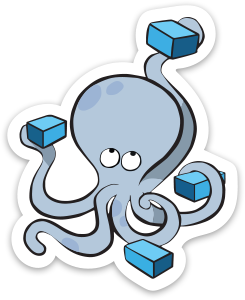

[![Contributors][contributors-shield]][contributors-url]
[![Forks][forks-shield]][forks-url]
[![Stargazers][stars-shield]][stars-url]
[![Licence][licence-shield]][licence-url]


<br />
<p align="center">
<a href="https://docs.docker.com/compose/">
    
</a>
<a href="https://www.datadoghq.com/">
    
</a>
<a href="https://www.jenkins.io/">
    
</a>

<h3 align="center">Jenkins with Datadog using Docker Compose</h3>

<p align="center">
    An example of how to integrate Datadog with Jenkins using Docker Compose
</p>
</p>


<!-- TABLE OF CONTENTS -->
<details open="open">
  <summary>Table of Contents</summary>
  <ol>
    <li>
      <a href="#about-the-project">About The Project</a>
      <ul>
        <li><a href="#built-with">Built With</a></li>
      </ul>
    </li>
    <li>
      <a href="#getting-started">Getting Started</a>
      <ul>
        <li><a href="#prerequisites">Prerequisites</a></li>
        <li><a href="#installation">Installation</a></li>
      </ul>
    </li>
    <li><a href="#usage">Usage</a></li>
    <li><a href="#license">License</a></li>
    <li><a href="#acknowledgements">Acknowledgements</a></li>
  </ol>
</details>

## About The Project

Jenkins, Datadog and Docker are three great products - but have you ever tried to use them all in one project?

Here's why:
* Your time should be focused on creating something amazing. This repository shows a basic setup to get you started quicker and faster!
* You shouldn't be re-inventing the wheel. Use your time to improve on what other people have already created!
* You can use this repository as a base to monitor other products with Datadog as well!

So I have created this repository to help those who need a helping-hand or get moving quicker!

### Built With
* [Jenkins](https://www.jenkins.io/)
* [Datadog](https://www.datadoghq.com/)
* [Docker Desktop for Windows](https://docs.docker.com/docker-for-windows/install/)

## Getting Started

This is an example of how you may start setting up your project locally.
To get a local copy up and running follow these simple example steps.

### Prerequisites

* Install [WSL2](https://docs.microsoft.com/en-us/windows/wsl/install-win10) if you're using Windows. Not required for Mac or Linux.
* Install [Docker Desktop](https://docs.docker.com/desktop/) or the Linux equivalent. Keep in mind that this repository demonstrates the a working Windows example.

### Installation

1. Get a free trial API Key at [https://www.datadoghq.com/](https://www.datadoghq.com/)
2. Clone the repo
   ```sh
   git clone https://github.com/trungisme/jenkins-and-datadog-with-docker.git
   ```
3. Create a file with the API Key
   ```sh
   echo "<REPLACE_WITH_DATADOG_API_KEY>" > .env
   ```
4. Bring up your Docker network
   ```sh
   docker compose up -d
   ```
5. Wait for Jenkins and Datadog to come up.
6. Navigate to Jenkins in the browser via [http://localhost:8080](http://localhost:8080)
7. In the Datadog app, navigate to Integrations and search for Jenkins and install it to Datadog.
8. Now Jenkins and Datadog should be connected!

## Usage

Now you can create a job and run it and the build results should appear within Datadog.
You can navigate to Dashboards > Dashboard List > Jenkins - Overview for an example dashboard.

Happy Monitoring!

## License

Distributed under the MIT License. See `LICENSE` for more information.

## Acknowledgements
* [Best README Template](https://github.com/othneildrew/Best-README-Template)

<!-- MARKDOWN LINKS & IMAGES -->
<!-- https://www.markdownguide.org/basic-syntax/#reference-style-links -->
[contributors-shield]: https://img.shields.io/github/contributors/othneildrew/Best-README-Template.svg?style=for-the-badge
[contributors-url]: https://github.com/trungisme/jenkins-and-datadog-with-docker/graphs/contributors
[forks-shield]: https://img.shields.io/github/forks/othneildrew/Best-README-Template.svg?style=for-the-badge
[forks-url]: https://github.com/trungisme/jenkins-and-datadog-with-docker/network/members
[stars-shield]: https://img.shields.io/github/stars/othneildrew/Best-README-Template.svg?style=for-the-badge
[stars-url]: https://github.com/trungisme/jenkins-and-datadog-with-docker/stargazers
[licence-shield]: https://img.shields.io/github/license/othneildrew/Best-README-Template.svg?style=for-the-badge
[licence-url]: https://github.com/trungisme/jenkins-and-datadog-with-docker/blob/master/LICENSE.txt
